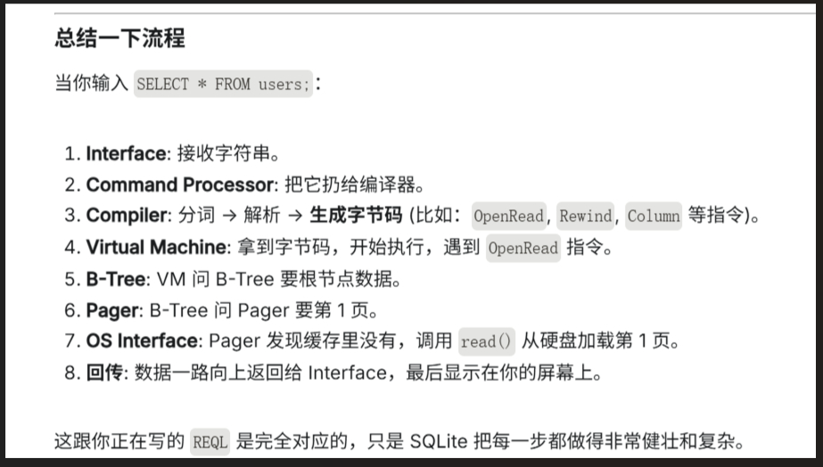
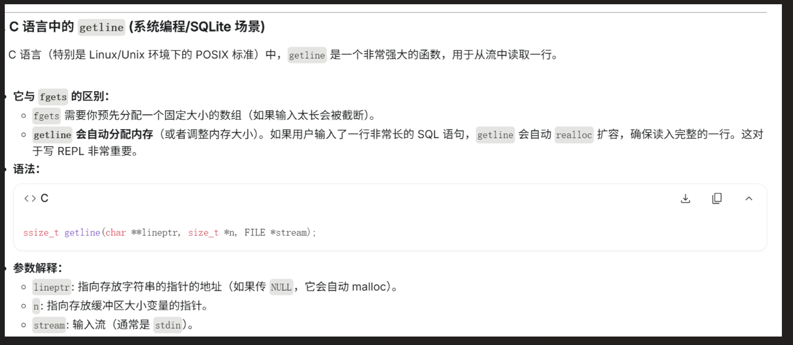

# **用来给自我复盘的文件说明**
完整流程:

---

## 第一阶段：2025.12.25-2026.1.1

---

### 思路
1. 完成了基本的输入内容的堆创建，明确了堆的写入，初始化和释放
2. 明确了非元指令和元指令（.exit和statement）的区分,和不同的结构体的创建，里面结构体的包含思路是要理清的
3. 进行了表（行数和页数地址决定），页，行的明确划分，形成了单列表（EX：学生系统）
6. 进行数据的管理的两种模式：select和insert
7. 实现了用指令将数据放在页的行数里（serialize_row），和从页里提取行的功能(deserialize_row)

---

### 难点
1. 结构体的包含关系明确
2. 内存数据的移动，从输入内存保存的数据到列表里的数据的运算
3. 进行部分实体化的操作，加快内存的提取
4. 去除内存对齐的操作和进行流答应

---

### 三、函数与代码

#### 1. getline 的优势


#### 2. 重点宏定义
这个宏定义的作用是：**在不创建结构体实例的情况下，获取结构体中某个成员变量的数据类型大小**。

```c
#define size_of_attribute(Struct, Attribute) sizeof(((Struct*)0)->Attribute)
```

#### 3. 进行去结构化，减少对齐内存
这边是对于行的紧凑表示的偏移量（相对于行首 offset），用于计算行的位置。

```c
// 偏移量定义
const uint32_t ID_OFFSET = 0;
const uint32_t USERNAME_OFFSET = ID_OFFSET + ID_SIZE;
const uint32_t EMAIL_OFFSET = USERNAME_OFFSET + USERNAME_SIZE_VAL;
const uint32_t ROW_SIZE = ID_OFFSET + ID_SIZE + USERNAME_SIZE_VAL + EMAIL_SIZE_VAL;

// 这边只是对于行的紧凑表示（减少内存占用）
// 实际上 sqlite 还有更多的数据结构和算法来优化性能

// 下面是页的紧凑表示：
const uint32_t PAGE_SIZE = 4096;
#define TABLE_MAX_PAGES 100
const uint32_t ROWS_PER_PAGE = PAGE_SIZE / ROW_SIZE; // 每页最多可以存储的行数
const uint32_t TABLE_MAX_ROWS = ROWS_PER_PAGE * TABLE_MAX_PAGES; // 表最大可以存储的行数
```

#### 4. 获取 row 的地址
这样设计可以高效管理大量行的内存，同时只在访问时分配实际需要的页，而不是一次性分配所有页的内存。

```c
/*
    获取行数据指针
    参数一: 表指针
    参数二: 行数
    返回: 行数据指针
*/
void* row_slot(Table* table, uint32_t row_num)
{
    uint32_t page_num = row_num / ROWS_PER_PAGE; // 计算所在的页数
    void* page = table->pages[page_num];         // 获取所在的页数据指针

    if(page == NULL)
    {
        // 如果页数据指针为空，则需要分配内存
        page = malloc(PAGE_SIZE);
        if(page == NULL)
        {
            printf("Error: malloc failed\n");
            exit(EXIT_FAILURE);
        }
        table->pages[page_num] = page; // 将页数据指针存储到表中
    }
    
    uint32_t row_offset = row_num % ROWS_PER_PAGE; // 计算所在的行偏移量
    char* page_ptr = (char*)page;
    return page_ptr + row_offset * ROW_SIZE; // 返回所在的行数据指针
}
```

#### 5. memcpy 函数的运用
这里展示了反序列化（将内存数据还原为结构体）的过程。

```c
/*
    memcpy函数用于将数据从源地址复制到目标地址
    第一个参数：目标地址
    第二个参数：源地址
    第三个参数：复制的数据大小
*/
char* src = (char*)source;
memcpy(&(destination->ID), src + ID_OFFSET, ID_SIZE);
memcpy(&(destination->username), src + USERNAME_OFFSET, USERNAME_SIZE_VAL);
memcpy(&(destination->email), src + EMAIL_OFFSET, EMAIL_SIZE_VAL);
```
